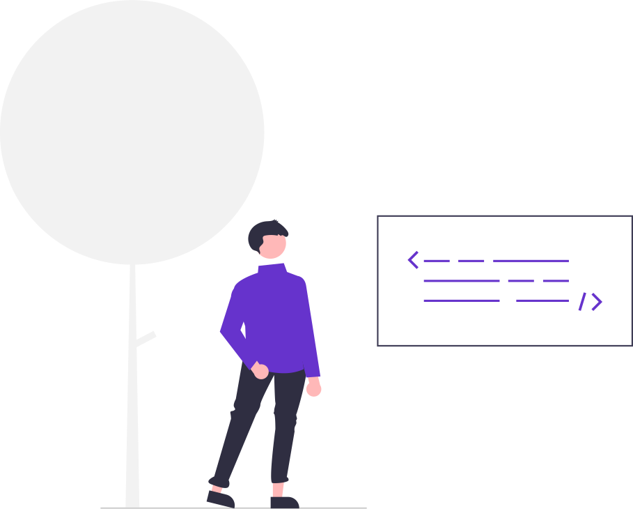

<h1 align="left">Hey there 👋, I'm Sandeep Ashok</h1> 
<h3 align="left" >A passionate frontend developer from Bengaluru, India</h3>  

  
  
  
  
  

<h3 align="left">Technologies I am familiar with:</h3>  

  

  
  
  
  
